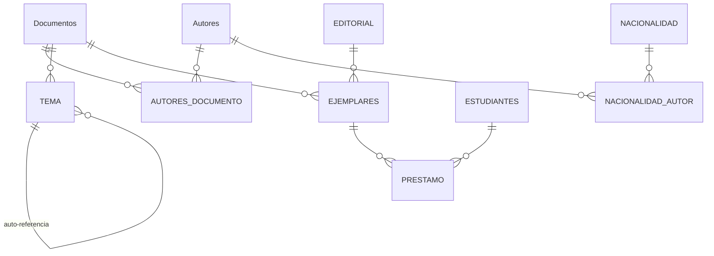
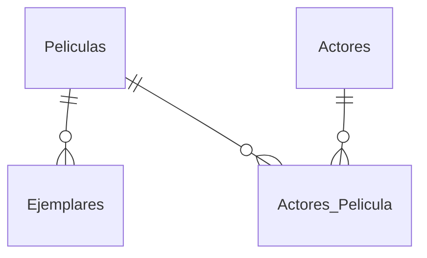

# Taller SQL — Estilo Oracle

Ejercicios de diseño de bases de datos en sintaxis Oracle (VARCHAR2, NUMBER, TO_DATE). Sigue la metodología de crear tablas primero sin restricciones y luego agregarlas vía `ALTER TABLE`.

## Componentes

| Archivo | Descripción |
|---|---|
| `talller.sql` | **Sistema de biblioteca**: 10 tablas (Documentos, Autores, TEMA, EJEMPLARES, PRESTAMO, EDITORIAL, ESTUDIANTES, etc.) con PK, FK, UNIQUE, CHECK y NOT NULL vía ALTER |
| `INSERTANDO _DATOS_TALLER.SQL` | 30 documentos (libros, revistas, artículos) y 30 autores con datos reales (García Márquez, Kafka, Nabokov, etc.) |
| `base_pelicula.sql` | **Videoclub**: Películas, Ejemplares, Actores, Actores_Pelicula con PK y FK |
| `restricciones_nases.sql` | Extensiones al videoclub: CHECK de dominios (Género, Formato, Estado), NOT NULL, UNIQUE |
| `CREATE_TABLE.SQL` | INSERTs, GRANT de permisos y TRUNCATE |
| `text.txt` | Notas de planificación: metodología de creación y normalización |

## Modelo de Biblioteca

## Modelo de Videoclub

## Convenciones aplicadas

- Se crean las tablas primero **sin restricciones**
- Luego `ALTER TABLE ADD CONSTRAINT` para PK, FK, UNIQUE, CHECK
- `CHECK(col IS NOT NULL)` en lugar de `NOT NULL` a nivel columna
- Restricciones CHECK para validar dominios (Género: `ACC, DRA, ROM, TER, COM, WES`; Formato: `DVD, CD, VHS, BET, BRAY`)
- Fechas con `TO_DATE(..., 'YYYY/MM/DD')`
- Esquemas con doble comilla (`"ACOSTA"."DOCUMENTOS"`)
